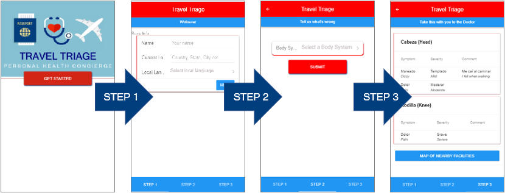
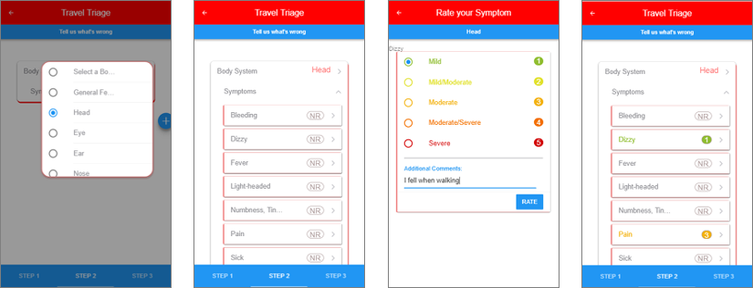
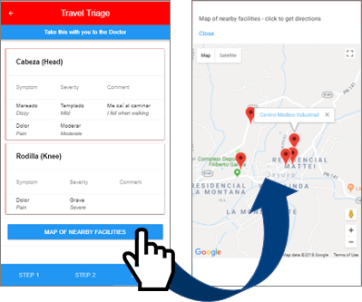

# TravelTriage
Group Project #1 (Erin Britton, Dominique Meeks, Lacie Forrest and Peter Carmines)

## Overview
According to the [Centers for Disease Control and Prevention], a traveler should "carry a card that identifies, in the local language, your blood type, any chronic illnesses you have, any medicines you are taking, and any allergies you have." However, this leaves a gap of communicating the acute reasons for an urgent care visit in the local language. The purpose of this web app is to provide a simple tool to document and translate medical symptoms to prepare for an urgent care visit abroad and to expedite the process of seeking care by suggesting nearby urgent care facilities. 

## Functionality
* The app consists of three steps:
  1. Enter name, current location, and local language 
  2. Enter symptoms, severity, and any additional comments about reasons for visit
  3. Share translated results with clinician and click to view nearby clinics

* Symptom Selection (add as many body systems and symptoms as needed)
  1. Associate a symptom with an area of the body or document as a "general feeling"
  2. Choose a symptom from a list of options based on the selected body system  
  3. Rate the severity of the symptom and add any additional comments about reasons for visit
    - Mild (1)
    - Mild/Moderate (2)
    - Moderate (3)
    - Moderate/Severe (4)
    - Severe (5)

* Find a nearby clinics by tapping "Map of Nearby Facilities"
* Selecting the link within a marker's tooltip opens the map app with directions to the facility

## Future Development Goals

* Add functionality to allow entry of medications, allergies, blood type, and chronic illnesses (in the event the user does not store this information in a health app or carry the above described card when traveling)

[Centers for Disease Control and Prevention]: https://wwwnc.cdc.gov/travel/page/getting-health-care-abroad